# ☁️ Practical Azure Administration

> **Learn Azure the hands-on way** — short lessons, real tasks, instant feedback.

---

## 🗺️ Course Map

```mermaid
graph LR
    A([🏠 Start]) --> B[📖 Lesson 1\nWhat is Cloud Shell?]
    B --> C[🛠️ Lesson 2\nCloud Shell in Action]
    C --> D[🎯 Practice 1\nExplore & Navigate]
    D --> E[✅ Solution 1]
    E --> F[🎯 Practice 2\nCode Editor & Scripts]
    F --> G[✅ Solution 2]
    G --> H[🧭 Troubleshooting\nRestore CloudDrive]
    H --> I[📖 Lesson 3\nIaC Template Structure]
    I --> J[📖 Lesson 4\nARM Field Guide]
    J --> K[🎯 Practice 3\nBuild & Deploy Template]
    K --> L[✅ Solution 3]
    L --> M[🎯 Practice 4\nTemplate Reading + Outputs]
    M --> N[✅ Solution 4]

    style A fill:#5C7CFA,color:#fff
    style B fill:#74C0FC,color:#000
    style C fill:#74C0FC,color:#000
    style D fill:#F59F00,color:#fff
    style E fill:#51CF66,color:#fff
    style F fill:#F59F00,color:#fff
    style G fill:#51CF66,color:#fff
    style H fill:#FF922B,color:#fff
    style I fill:#74C0FC,color:#000
    style J fill:#F59F00,color:#fff
    style K fill:#F59F00,color:#fff
    style L fill:#51CF66,color:#fff
    style M fill:#F59F00,color:#fff
    style N fill:#51CF66,color:#fff
```

---

## 📚 Module 1: Azure Cloud Shell

| # | Lesson | Type | Time |
|---|--------|------|------|
| 1 | [What is Azure Cloud Shell?](lessons/01-what-is-cloud-shell.md) | 📖 Concept | ~3 min |
| 2 | [Cloud Shell in Action](lessons/02-cloud-shell-in-action.md) | 🛠️ Practical | ~6 min |
| 3 | [Practice Task 1 — Explore & Navigate](lessons/03-practice-task-1.md) | 🎯 Task | ~5 min |
| 4 | [Solution 1](lessons/04-solution-1.md) | ✅ Solution | ~2 min |
| 5 | [Practice Task 2 — Code Editor & Scripts](lessons/05-practice-task-2.md) | 🎯 Task | ~5 min |
| 6 | [Solution 2](lessons/06-solution-2.md) | ✅ Solution | ~2 min |
| 7 | [Fix Missing `~/clouddrive`](lessons/07-cloud-shell-ephemeral-sessions.md) | 🧭 Troubleshooting | ~2 min |

---

## 📦 Module 2: Infrastructure as Code (ARM)

| # | Lesson | Type | Time |
|---|--------|------|------|
| 8 | [IaC with ARM Templates (Structure First)](lessons/08-iac-template-structure.md) | 📖 Concept + Interactive | ~7 min |
| 9 | [ARM Template Field Guide (What Each Field Does)](lessons/11-arm-template-field-guide.md) | 📖 Concept + Visual | ~8 min |
| 10 | [Practice Task 3 — Build & Deploy Your First IaC Template](lessons/09-practice-task-3-iac.md) | 🎯 Task | ~8 min |
| 11 | [Solution 3](lessons/10-solution-3-iac.md) | ✅ Solution | ~4 min |
| 12 | [Practice Task 4 — Read, Predict, and Extend an ARM Template](lessons/12-practice-task-4-arm-template-reading.md) | 🎯 Task | ~8 min |
| 13 | [Solution 4](lessons/13-solution-4-arm-template-reading.md) | ✅ Solution | ~5 min |

### 💡 How to Learn the IaC Module Effectively

If ARM templates are new to you, follow this sequence for better understanding:

1. **Read Lesson 3 first** to understand template structure and deployment flow
2. **Use Lesson 4 as your reference** while working through the practice tasks
3. **Do each practice before opening its solution** so you build real reading/deployment confidence
4. **Run `validate` and `what-if` every time** before `create` to avoid accidental mistakes

> 🎯 Goal: By the end of Module 2, you should be able to read an ARM template and predict deployment results before running it.

> ℹ️ File names keep their original IDs from earlier revisions; the **#** column above shows the current lesson order.

---

## 🚀 How to Use This Course

- **Read** each lesson in order
- **Try** every command in your own Azure Cloud Shell session
- **Complete** the practice tasks before peeking at the solutions
- **Celebrate progress** — each lesson ends with a quick win 🎉

> 💡 **No Azure subscription yet?**  
> You can still follow along using the [free Azure trial](https://azure.microsoft.com/free/).

---

## 🛠️ Prerequisites

- A web browser (any modern browser works)
- An Azure account ([free tier](https://azure.microsoft.com/free/) is fine)
- Curiosity 🔍

---

## 📈 Progress Tracker

| Module | Status |
|--------|--------|
| Azure Cloud Shell | ✅ Complete |
| Infrastructure as Code (ARM) | 🟦 In Progress |
| _More modules coming soon_ | ⬜ Locked |
