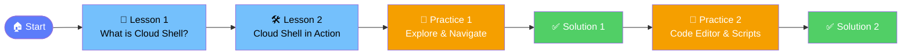

# ☁️ Practical Azure Administration

> **Learn Azure the hands-on way** — short lessons, real tasks, instant feedback.

---

## 🗺️ Course Map

---

## 📚 Module: Azure Cloud Shell

| # | Lesson | Type | Time |
|---|--------|------|------|
| 1 | [What is Azure Cloud Shell?](lessons/01-what-is-cloud-shell.md) | 📖 Concept | ~3 min |
| 2 | [Cloud Shell in Action](lessons/02-cloud-shell-in-action.md) | 🛠️ Practical | ~6 min |
| 3 | [Practice Task 1 — Explore & Navigate](lessons/03-practice-task-1.md) | 🎯 Task | ~5 min |
| 4 | [Solution 1](lessons/04-solution-1.md) | ✅ Solution | ~2 min |
| 5 | [Practice Task 2 — Code Editor & Scripts](lessons/05-practice-task-2.md) | 🎯 Task | ~5 min |
| 6 | [Solution 2](lessons/06-solution-2.md) | ✅ Solution | ~2 min |

---

## 🚀 How to Use This Course

- **Read** each lesson in order
- **Try** every command in your own Azure Cloud Shell session
- **Complete** the practice tasks before peeking at the solutions
- **Track your XP** — each lesson rewards you with points!

> 💡 **No Azure subscription yet?**  
> You can still follow along using the [free Azure trial](https://azure.microsoft.com/free/).

---

## 🛠️ Prerequisites

- A web browser (any modern browser works)
- An Azure account ([free tier](https://azure.microsoft.com/free/) is fine)
- Curiosity 🔍

---

## 📈 Progress Tracker

| Module | Status |
|--------|--------|
| Azure Cloud Shell | 🟦 In Progress |
| _More modules coming soon_ | ⬜ Locked |

---

_Built with ❤️ for Azure admins who learn by doing._