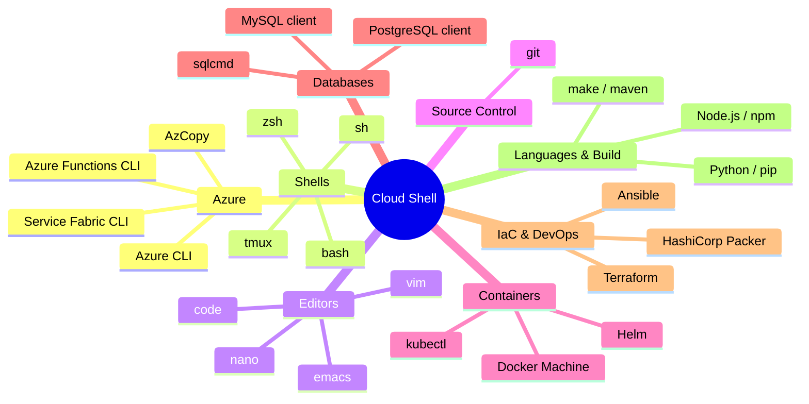

# 📖 Lesson 1 — What is Azure Cloud Shell?

> ⏱️ ~3 minutes &nbsp;|&nbsp; 📖 Concept

---

## 🎯 Learning Goal

By the end of this lesson you will be able to answer:

- [ ] What is Azure Cloud Shell?
- [ ] How can I open it?
- [ ] Which tools are already installed?

---

## ⚡ The One-Sentence Version

> **Azure Cloud Shell is a browser-based command line that gives you a fully configured Linux environment to manage Azure — no installation needed.**

---

## 🌐 Three Ways to Open It

```
╔══════════════════════════════════════════════════════════════╗
║  Option 1 › Direct link                                      ║
║  👉  https://shell.azure.com                                  ║
╠══════════════════════════════════════════════════════════════╣
║  Option 2 › Azure Portal                                     ║
║  👉  Click the  >_  icon in the top toolbar                   ║
╠══════════════════════════════════════════════════════════════╣
║  Option 3 › Microsoft Learn                                  ║
║  👉  Click "Try it" inside any code snippet                   ║
╚══════════════════════════════════════════════════════════════╝
```

---

## 🔀 Pick Your Shell

When you open Cloud Shell for the first time, choose your flavour:

```
┌─────────────────────────────────────────┐
│   Which shell experience do you want?   │
│                                         │
│   ● Bash      ○ PowerShell             │
│                                         │
│   [ Confirm ]                           │
└─────────────────────────────────────────┘
```

> 💡 You can switch at any time with the shell selector in the Cloud Shell toolbar.

---

## 🧰 What's Already Installed?

You never have to `apt install` or `pip install` anything essential — it's all there.



---

## 🏠 Your Personal Cloudy Home

```
Your Browser
     │
     │  HTTPS
     ▼
┌─────────────────────────────────────────────┐
│           Azure Cloud Shell Host             │
│                                             │
│  ┌──────────┐   ┌────────────────────────┐  │
│  │ Terminal │   │  Azure File Share      │  │
│  │ (Bash /  │◄──│  (your persistent      │  │
│  │  PS)     │   │   files & scripts)     │  │
│  └──────────┘   └────────────────────────┘  │
└─────────────────────────────────────────────┘
         │
         │  Azure SDK / REST API
         ▼
   Azure Resources
   (VMs, storage, DBs, …)
```

**Key facts:**
- Sessions auto-close after **20 minutes** of inactivity
- Files stored in `~/clouddrive` **persist** between sessions
- Each session gets a **fresh temporary VM** — your shell history won't disappear, but any software you installed manually will

---

## 🚫 When NOT to Use Cloud Shell

| Situation | Use Instead |
|-----------|-------------|
| Script runs > 20 minutes | Azure Automation Runbook |
| Need `sudo` / admin access | Local terminal or VM |
| Need tools not in Cloud Shell | Custom container / VM |
| Multiple concurrent sessions | Local terminal |
| Multi-region storage needs | Azure Storage Explorer |

---

## 🧠 Quick-Fire Facts

- ✅ Works from **any browser** — even a phone
- ✅ **No plug-ins** to install on your device
- ✅ Bash **and** PowerShell available
- ✅ Files persist via **Azure File Share**
- ✅ Built-in **code editor** (`{}` icon or `code filename`)
- ⏳ Disconnects after **20 min** of inactivity

---

## 🏆 Lesson Complete!

🎉 Nice work — Lesson 1 complete.

**Next up →** [Lesson 2 — Cloud Shell in Action](02-cloud-shell-in-action.md)

---

_← [Back to Course Map](../README.md)_
