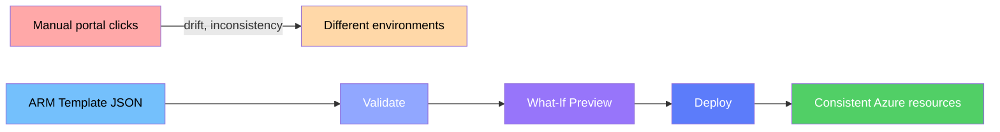
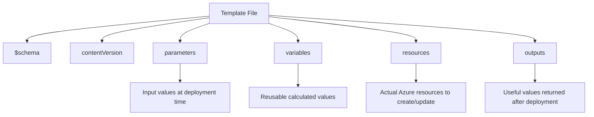

# 📖 Lesson 3 — IaC with ARM Templates (Structure First)

> ⏱️ ~7 minutes &nbsp;|&nbsp; 📖 Concept + Interactive

---

## 🎯 Learning Goal

By the end of this lesson, you will be able to:

- [ ] Explain why IaC is safer than click-ops for repeatable Azure deployments
- [ ] Recognize every core ARM template section
- [ ] Read a template and predict what Azure will create

---

## 🧭 Why This Lesson Matters

When teams deploy manually through the portal, environments slowly drift apart.
IaC solves this by turning infrastructure into versioned, repeatable files.

In this lesson, focus on understanding the **shape** of an ARM template first.
Once the structure is clear, writing and debugging templates becomes much easier.

---

## 🧠 IaC in One Picture



---

## 🧩 ARM Template Anatomy (Show, then name)

```json
{
  "$schema": "https://schema.management.azure.com/schemas/2019-04-01/deploymentTemplate.json#",
  "contentVersion": "1.0.0.0",
  "parameters": {},
  "variables": {},
  "resources": [],
  "outputs": {}
}
```



---

## 🛠️ Guided Walkthrough in Cloud Shell

Before you start:

- Make sure you are in a Cloud Shell session with persistent `~/clouddrive`
- Use a resource group where you have deployment permission
- Keep this lesson open while practicing so you can map each section quickly

Create a workspace and starter files:

```bash
mkdir -p ~/clouddrive/iac-lab
cd ~/clouddrive/iac-lab
code azuredeploy.json
code azuredeploy.parameters.json
```

> 💡 If `code` fails, switch Cloud Shell to Classic mode (`...` → Settings → Go to Classic version).

---

## 👀 Visualize the Deployment Flow

```
azuredeploy.json + azuredeploy.parameters.json
                    │
                    ▼
           az deployment group validate
                    │
                    ▼
            az deployment group what-if
                    │
                    ▼
             az deployment group create
                    │
                    ▼
         Resource Group now matches template
```

---

## 🔍 Mini Read Challenge

When you see this snippet:

```json
"parameters": {
  "storageAccountName": {
    "type": "string"
  },
  "location": {
    "type": "string",
    "defaultValue": "westeurope"
  }
}
```

You should immediately infer:
- `storageAccountName` must be provided (no default)
- `location` is optional because it has a default
- both values can be reused in `resources` and `outputs`

---

## ✅ Quick Check

Before moving on, confirm you can answer:

- Which section creates Azure resources? → `resources`
- Which section returns values after deployment? → `outputs`
- Which command previews changes before deployment? → `what-if`

---

## 🏆 Lesson Complete!

🎉 Nice work — you now read ARM templates like a deployment plan, not a mystery file.

**Next up →** [Lesson 4 — ARM Template Field Guide (What Each Field Does)](11-arm-template-field-guide.md)

---

_← [Back to Course Map](../README.md)_
