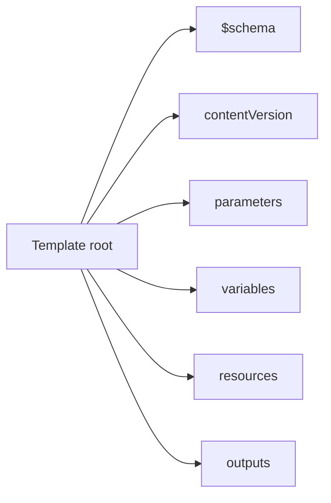
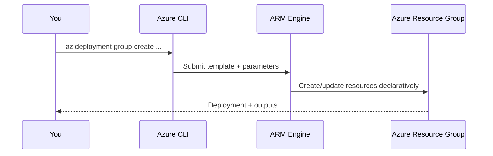

# 🎯 Practice Task 3 — Build & Deploy Your First IaC Template

> ⏱️ ~8 minutes &nbsp;|&nbsp; 🎯 Task

---

## 🧑‍💻 Your Mission

You're now the on-call admin responsible for standardizing deployments.
No portal clicking allowed. Use **ARM template + Azure CLI** only.

---

## �� Task Checklist

```
☐  Exercise 1 — Create ARM template skeleton
☐  Exercise 2 — Add a storage account resource
☐  Exercise 3 — Add outputs and parameter file
☐  Exercise 4 — Validate and preview with what-if
☐  Exercise 5 — Deploy and verify result
```

---

## 🧪 Exercise 1 — Create the Template Skeleton

In `~/clouddrive/iac-lab`, create `azuredeploy.json` containing:

- `$schema`
- `contentVersion`
- `parameters`
- `variables`
- `resources`
- `outputs`

Use this structure map as your guide:



---

## 🧪 Exercise 2 — Add a Storage Account Resource

Add parameters:
- `storageAccountName` (string)
- `location` (string, default to resource group's location)

Then define one `Microsoft.Storage/storageAccounts` resource:
- API version: `2023-01-01`
- SKU: `Standard_LRS`
- Kind: `StorageV2`

Target shape:

```
Resource Group
   └── Storage Account
       ├── name = parameter value
       ├── location = parameter/default
       └── sku = Standard_LRS
```

---

## 🧪 Exercise 3 — Add Outputs + Parameters File

Create `azuredeploy.parameters.json` and pass:
- `storageAccountName`

In template `outputs`, return:
- `storageAccountId`
- `storageAccountName`

---

## 🧪 Exercise 4 — Validate + What-If

Use Azure CLI to run:

1. `validate`
2. `what-if`

Expected behavior:
- Validate returns success
- What-if predicts one storage account creation

```text
Change summary should include something like:
Resource changes: + Create
```

---

## 🧪 Exercise 5 — Deploy + Verify

Deploy to a resource group you already have (or create one first).
Then verify the storage account exists and matches your template settings.



---

## 💡 Tips

- Storage account names must be globally unique and lowercase
- Keep template values parameterized for reuse across environments
- If `what-if` output looks wrong, fix template first, then deploy

---

## ✅ Done? Check Your Answers

→ [View Solution 3](10-solution-3-iac.md)

---

_← [Back to Course Map](../README.md)_
