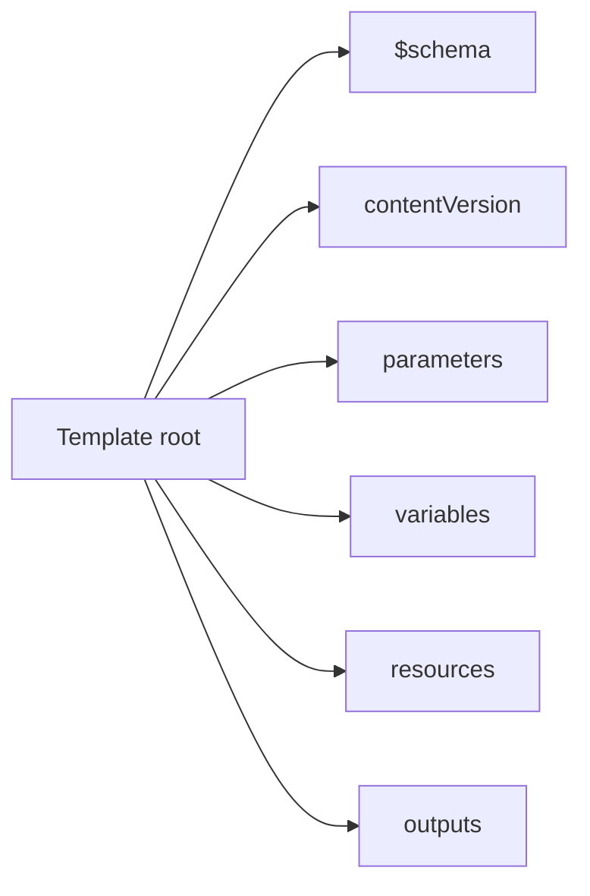
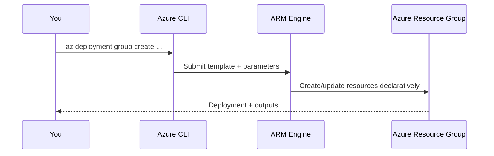

# 🎯 Practice Task 3 — Build & Deploy Your First IaC Template

> ⏱️ ~8 minutes &nbsp;|&nbsp; 🎯 Task

---

## 🧑‍💻 Your Mission

You're now the on-call admin responsible for standardizing deployments.
No portal clicking allowed. Use **ARM template + Azure CLI** only.

---

## 🧭 Before You Begin

This practice expects that you already understand:

- ARM template root fields (`parameters`, `resources`, `outputs`)
- Basic Azure CLI deployment commands
- Why `validate` and `what-if` are safer than deploying immediately

If any of these feel unclear, quickly review:
- [Lesson 3 — IaC with ARM Templates](08-iac-template-structure.md)
- [Lesson 4 — ARM Template Field Guide](11-arm-template-field-guide.md)

---

## ✅ Task Checklist

```
☐  Exercise 1 — Fill missing fields in a starter template
☐  Exercise 2 — Add a storage account resource
☐  Exercise 3 — Add outputs and parameter file
☐  Exercise 4 — Validate and preview with what-if
☐  Exercise 5 — Deploy and verify result
```

---

## 🧪 Exercise 1 — Fill Missing Fields in a Starter Template

Start simple: this step is about building a correct template skeleton first.
Do not rush into resource properties until the root structure is valid.

In `~/clouddrive/iac-lab`, create `azuredeploy.json` by pasting this starter and filling only the `TODO` values:

```json
{
  "$schema": "TODO",
  "contentVersion": "TODO",
  "parameters": {
    "storageAccountName": {
      "type": "string"
    },
    "location": {
      "type": "string",
      "defaultValue": "[resourceGroup().location]"
    }
  },
  "variables": {},
  "resources": [],
  "outputs": {}
}
```

Use these quick guides:
- `$schema`: standard ARM deployment template schema URL
- `contentVersion`: `1.0.0.0`
- In Exercise 2, use `apiVersion: 2023-01-01` and verify in Azure template reference:  
  https://learn.microsoft.com/azure/templates/microsoft.storage/storageaccounts

Use this structure map as your guide:



---

## 🧪 Exercise 2 — Add a Storage Account Resource

Now convert your skeleton into real infrastructure by adding one resource block.
Think of this as your first full declarative deployment definition.

Add parameters:
- `storageAccountName` (string)
- `location` (string, default to resource group's location)

Then define one `Microsoft.Storage/storageAccounts` resource:
- API version: `2023-01-01`
- SKU: `Standard_LRS`
- Kind: `StorageV2`

Target shape:

```
Resource Group
   └── Storage Account
       ├── name = parameter value
       ├── location = parameter/default
       └── sku = Standard_LRS
```

---

## 🧪 Exercise 3 — Add Outputs + Parameters File

This step improves reusability:
- Parameter files let you deploy the same template across environments
- Outputs expose important values for scripts and follow-up automation

Create `azuredeploy.parameters.json` and pass:
- `storageAccountName`

In template `outputs`, return:
- `storageAccountId`
- `storageAccountName`

---

## 🧪 Exercise 4 — Validate + What-If

Treat this as a mandatory safety gate:
- `validate` catches schema/rule issues
- `what-if` shows expected changes before anything is applied

Use Azure CLI to run:

1. `validate`
2. `what-if`

Expected behavior:
- Validate returns success
- What-if predicts one storage account creation

```text
Change summary should include something like:
Resource changes: + Create
```

---

## 🧪 Exercise 5 — Deploy + Verify

Only deploy once your preview looks correct.
Verification is part of the task: confirm Azure matches what your template declared.

Deploy to a resource group you already have (or create one first).
Then verify the storage account exists and matches your template settings.



---

## 💡 Tips

- Storage account names must be globally unique and lowercase
- Keep template values parameterized for reuse across environments
- If `what-if` output looks wrong, fix template first, then deploy

---

## ✅ Done? Check Your Answers

→ [View Solution 3](10-solution-3-iac.md)

---

_← [Back to Course Map](../README.md)_
