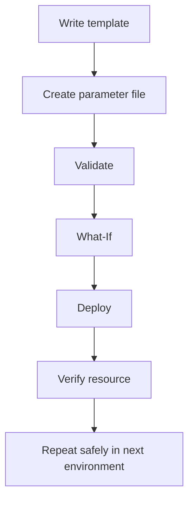

# ✅ Solution 3 — Build & Deploy Your First IaC Template

> **Review your answers below.**

---

## Exercise 1 — Starter Template (Filled) ✅

`azuredeploy.json`:

```json
{
  "$schema": "https://schema.management.azure.com/schemas/2019-04-01/deploymentTemplate.json#",
  "contentVersion": "1.0.0.0",
  "parameters": {
    "storageAccountName": {
      "type": "string",
      "minLength": 3,
      "maxLength": 24,
      "metadata": {
        "description": "Globally unique storage account name"
      }
    },
    "location": {
      "type": "string",
      "defaultValue": "[resourceGroup().location]",
      "metadata": {
        "description": "Deployment location"
      }
    }
  },
  "variables": {},
  "resources": [
    {
      "type": "Microsoft.Storage/storageAccounts",
      "apiVersion": "2023-01-01",
      "name": "[parameters('storageAccountName')]",
      "location": "[parameters('location')]",
      "sku": {
        "name": "Standard_LRS"
      },
      "kind": "StorageV2",
      "properties": {}
    }
  ],
  "outputs": {
    "storageAccountId": {
      "type": "string",
      "value": "[resourceId('Microsoft.Storage/storageAccounts', parameters('storageAccountName'))]"
    },
    "storageAccountName": {
      "type": "string",
      "value": "[parameters('storageAccountName')]"
    }
  }
}
```

---

## Exercise 2 & 3 — Parameters + Outputs ✅

`azuredeploy.parameters.json`:

```json
{
  "$schema": "https://schema.management.azure.com/schemas/2019-04-01/deploymentParameters.json#",
  "contentVersion": "1.0.0.0",
  "parameters": {
    "storageAccountName": {
      "value": "stiaclab001xyz"
    }
  }
}
```

> ⚠️ Replace `stiaclab001xyz` with your own globally unique name.

---

## Exercise 4 — Validate + What-If ✅

```bash
# optional: create/select resource group first
az group create --name rg-iac-lab --location westeurope

# validate template syntax and rules
az deployment group validate \
  --resource-group rg-iac-lab \
  --template-file azuredeploy.json \
  --parameters @azuredeploy.parameters.json

# preview changes before deployment
az deployment group what-if \
  --resource-group rg-iac-lab \
  --template-file azuredeploy.json \
  --parameters @azuredeploy.parameters.json
```

Example what-if summary:

```text
Resource and property changes are indicated with this symbol:
  + Create

Resource changes: 1 to create.
```

---

## Exercise 5 — Deploy + Verify ✅

```bash
# deploy
az deployment group create \
  --name deploy-storage-iac \
  --resource-group rg-iac-lab \
  --template-file azuredeploy.json \
  --parameters @azuredeploy.parameters.json

# verify storage account exists
az storage account show \
  --name stiaclab001xyz \
  --resource-group rg-iac-lab \
  --query "{name:name, location:primaryLocation, sku:sku.name, kind:kind}" \
  --output table
```

Expected output shape:

```text
Name           Kind       Location    Sku
-------------  ---------  ----------  ------------
stiaclab001xyz StorageV2  westeurope  Standard_LRS
```

---

## 🔑 Visual Recap



---

## 🏆 Progress Check

| Task | Status |
|------|--------|
| Exercise 1 — Starter template completed | ✅ Done |
| Exercise 2 — Storage resource | ✅ Done |
| Exercise 3 — Outputs + parameters file | ✅ Done |
| Exercise 4 — Validate + what-if | ✅ Done |
| Exercise 5 — Deploy + verify | ✅ Done |
| **All exercises completed** | **🎉 Excellent work!** |

---

## ⏭️ Next Step

Continue with [Practice Task 4 — Read, Predict, and Extend an ARM Template](12-practice-task-4-arm-template-reading.md).

---

**→ [Back to Course Map](../README.md)**
