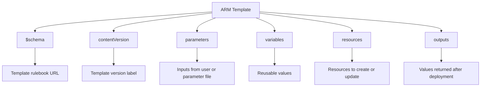

# 📖 Lesson 4 — ARM Template Field Guide (What Each Field Does)

> ⏱️ ~8 minutes &nbsp;|&nbsp; 📖 Concept + Visual

---

## 🎯 Learning Goal

By the end of this lesson, you will be able to:

- [ ] Explain what each main ARM template field does
- [ ] Recognize common fields inside a resource block
- [ ] Read a template quickly and spot missing pieces

---

## 🧠 One Visual: Template at a Glance

---

## 🧩 Root-Level Fields (Simple Guide)

| Field | What it does | Why it matters |
|------|---------------|----------------|
| `$schema` | Points to ARM template schema | Helps with validation and editor hints |
| `contentVersion` | Version string for your template file | Lets you track template revisions |
| `parameters` | Inputs passed at deployment time | Makes template reusable across environments |
| `variables` | Internal reusable values | Reduces repetition in long templates |
| `resources` | Declares Azure resources to deploy | This is where actual infrastructure is defined |
| `outputs` | Returns values after deployment | Useful for IDs, names, endpoints, next steps |

---

## 🏗️ Resource Block Fields (Common Ones)

When you are inside `resources`, these are the most common fields:

| Field | What it does |
|------|---------------|
| `type` | Resource type (example: `Microsoft.Storage/storageAccounts`) |
| `apiVersion` | API contract version used for that resource type |
| `name` | Resource name |
| `location` | Azure region |
| `sku` | Pricing/performance tier for supported services |
| `kind` | Resource flavor/category (depends on service) |
| `properties` | Service-specific configuration settings |
| `dependsOn` | Deployment order dependency on other resources |
| `condition` | Creates resource only when true |
| `tags` | Key-value metadata (owner, environment, cost center) |

---

## 🔎 Quick “Where Do I Find It?” Guide

Use this when unsure about exact field values:

1. Resource type + API version: Azure template reference for that resource type
2. Required/optional properties: same reference page under `properties`
3. Current resource settings: `az resource show` or service-specific `az ... show`

---

## ✅ Mini Read Challenge

If a template has:

- `parameters.storageAccountName` with no default
- `parameters.location` with default `[resourceGroup().location]`
- one resource in `resources`
- output `storageAccountId`

Then you should infer:

- you must provide only the storage account name
- location can be omitted safely
- deployment creates or updates one resource
- deployment returns an ID you can reuse in scripts

---

## 🏆 Lesson Complete!

🎉 Great work — you now understand what each main ARM field is responsible for.

**Next up →** [Practice Task 3 — Build & Deploy Your First IaC Template](09-practice-task-3-iac.md)

---

_← [Back to Course Map](../README.md)_
