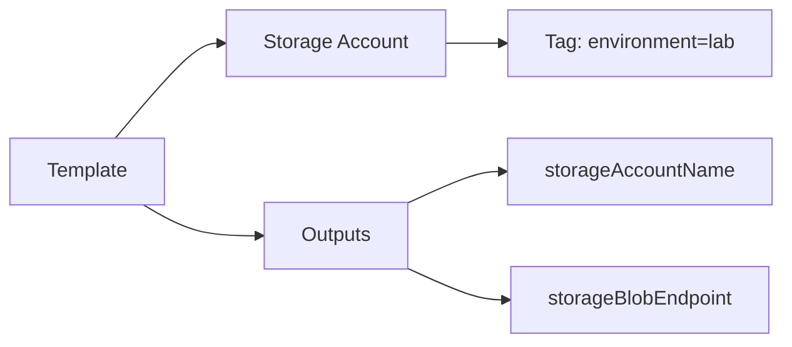

# 🎯 Practice Task 4 — Read, Predict, and Extend an ARM Template

> ⏱️ ~8 minutes &nbsp;|&nbsp; 🎯 Task

---

## 🧑‍💻 Your Mission

You already deployed a storage account once.  
Now practice reading and extending a template quickly.

---

## 🧭 Before You Begin

In this task, your goal is not just to deploy successfully.
Your real goal is to **predict behavior from template code before running commands**.

Use this mindset:
- Read parameters first (required vs optional)
- Predict expected changes
- Confirm your prediction with `what-if`

---

## ✅ Task Checklist

```
☐  Exercise 1 — Predict what a template does (before deploy)
☐  Exercise 2 — Fill missing fields (tags + output)
☐  Exercise 3 — Validate, what-if, and deploy
☐  Exercise 4 — Verify output and tag values
```

---

## 🧪 Exercise 1 — Predict First

Do this part before running any command.
This is the same skill used in real-world change reviews.

Read this snippet:

```json
"parameters": {
  "storageAccountName": { "type": "string" },
  "location": {
    "type": "string",
    "defaultValue": "[resourceGroup().location]"
  },
  "environmentTag": {
    "type": "string",
    "defaultValue": "lab"
  }
}
```

Write down your prediction:
- Which value is required?
- Which values are optional?
- What value should `environmentTag` become if you pass nothing?

---

## 🧪 Exercise 2 — Fill Missing Fields

Here you are extending an existing template with tags and outputs.
Focus on referencing parameters and deployed resources correctly.

Open your `azuredeploy.json` from Practice Task 3 and add the missing parts below.

```json
"tags": {
  "environment": "TODO"
},
"outputs": {
  "storageAccountName": {
    "type": "string",
    "value": "[parameters('storageAccountName')]"
  },
  "storageBlobEndpoint": {
    "type": "string",
    "value": "TODO"
  }
}
```

Guides:
- Tag value should come from `environmentTag` parameter
- Blob endpoint output can be read from ARM `reference(...)` function

---

## 🧪 Exercise 3 — Validate, What-If, Deploy

Run these in order and review output after each step.
If results differ from your prediction, fix the template before deployment.

Run:

1. `az deployment group validate`
2. `az deployment group what-if`
3. `az deployment group create`

Expected what-if behavior:

```text
Either + Create (first run) or ~ Modify (if resource already exists)
```

---

## 🧪 Exercise 4 — Verify

Verification proves your changes were actually applied, not just accepted.

Check:

- Output `storageBlobEndpoint` is returned
- Resource tag `environment` exists and equals `lab` (or your override)

Visual target:



---

## ✅ Done? Check Your Answers

→ [View Solution 4](13-solution-4-arm-template-reading.md)

---

_← [Back to Course Map](../README.md)_
